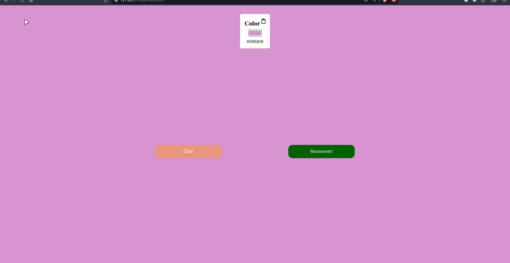

# js_dom_basic-2

## Project Aim
*Changing the background color with different user inputs using dom properties and methods*

✨🌼🚀🎈💢[Project Live Page](https://zlhshn.github.io/js_dom_basic-2/)🚀🍒🌼✨🎆

### Features of the page
- Background color changes when the button is clicked or hovered
- Setting the color selected from input as the background
- Setting the background color when the Enter key is pressed
- When you click on the copy icon, you can copy the relevant color.
